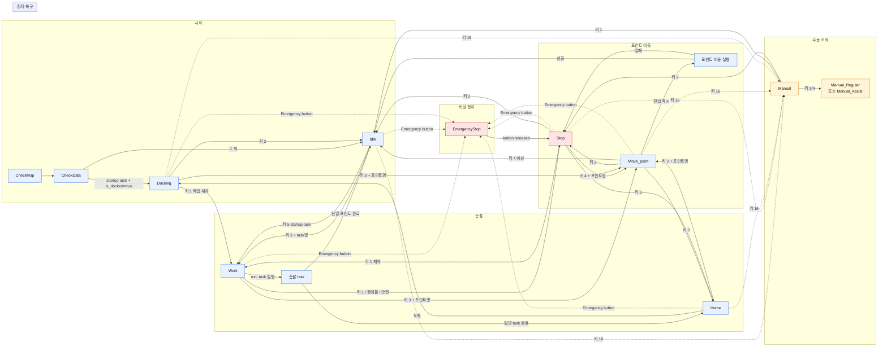

# state_machine_litever.cpp 기능 정리

## 1. 상태 목록

| 상태 | 역할 |
|---|---|
| `CheckMap` | 지도 및 설정 확인 |
| `CheckData` | 시작 작업과 도킹 여부 확인 |
| `Idle` | 작업 선택 대기 |
| `Work` | 순찰·작업 실행 |
| `Move_point` | 지정 포인트 이동 |
| `Stop` | 작업 정지 및 복구 선택 |
| `Home` | 홈 포인트 이동 |
| `Docking` | 충전 도크 진입·이탈 및 작업 대기 |
| `Manual` | 외부 조작기의 수동 속도 제어 |
| `Debug` | 포인트·작업·홈·영역 설정 |
| `EmergencyStop` | 비상 버튼 해제 전까지 정지 |

## 2. 시작 및 도킹 판단

```text
CheckMap → CheckData
              ├─ startup.task 존재 + 도킹 상태 true → Docking
              └─ 그 외                              → Idle
```

상태 머신은 `/dock/is_docked`(`std_msgs/Bool`)를 구독한다. 이 토픽은 상태
머신이 직접 UDP를 읽어서 만드는 값이 아니라, `robot_udp_connect`의
`docking_manager`가 UDP 상태를 종합해 발행한다.

`docking_manager`의 도킹 판단 기준은 다음과 같다.

| UDP 상태 | `/dock/is_docked` |
|---|---|
| `BasicStatus.charge == 2` (`Charging`) | `true` |
| `BatteryStatus.charge_left` 또는 `charge_right`가 `true` | `true` |
| `BasicStatus.charge == 5` (도크에 있으나 미충전) | `true` |
| 위 조건이 모두 아니면 | `false` |

따라서 `true`는 충전 중뿐 아니라 물리적으로 도크에 있거나 접점이 감지된
상태를 포함한다. `/dock/is_docked`가 2초 이상 갱신되지 않으면 상태 머신은
안전을 위해 도킹되지 않은 것으로 처리한다.

## 3. 순찰(run_task) 흐름

### 3.1 처음 켰을 때 Idle인 경우

```text
CheckMap → CheckData → Idle
                         ↓ run_task 입력(키 3) + task명
                       Work
                         ↓
                       순찰 실행
```

`Idle`에서 키 3을 입력하면 task YAML을 확인하고 `Work`로 진입한다.
task가 없으면 `Idle`에 유지된다.

### 3.2 처음 켰을 때 Docking인 경우

startup task가 있고 `/dock/is_docked == true`이면 `Docking`으로 시작한다.
도크에서 순찰을 시작하려면 도크 상태에서 Idle로 나온 뒤 run_task를 입력한다.

```text
CheckMap → CheckData → Docking
                         ↓ 키 2
                       Idle
                         ↓ 키 3 + task명
                       Work
```

startup task를 실행하는 경우에는 `Idle`에서 키 5를 사용한다.

```text
Docking → Idle → 키 5(startup.task) → Work
```

도크에서 작업을 시작할 때는 필요한 경우 도크 이탈이 먼저 수행된다.

### 3.3 순찰 중 Manual로 전환하는 경우

현재 구현에서는 `Work`에서 키 16을 직접 입력해 Manual로 갈 수 없다.
먼저 작업을 정지한 다음 Manual로 전환한다.

```text
Work
  ↓ 키 1 또는 장애물·안전 정지
Stop
  ↓ 키 16
Manual_Regular 또는 Manual_Assist
```

Manual 종료:

```text
Manual
  ├─ 키 1 → Idle
  └─ 키 2 → Stop
```

### 3.4 순찰 중 Move_point로 전환하는 경우

다른 상태에서 `Move_point`로 전환할 때는 포인트명을 전환 명령과 함께
전달한다. `Move_point` 진입 후 키 1을 다시 입력하지 않는다.

```text
Work
  ↓ 키 3 + 포인트명
Move_point
  ↓ 진입 즉시
포인트 이동 실행
  ├─ 성공 → Idle
  └─ 실패 → Stop
```

## 4. 주요 상태별 기능

### Idle

| 키 | 동작 |
|---:|---|
| 1 + 포인트명 | 단일 포인트 작업 실행 후 `Work` |
| 2 | 포인트 목록 표시 |
| 3 + task명 | 선택한 task 실행 후 `Work` |
| 4 | 도킹 중이면 도크 이탈, 아니면 `Home` |
| 5 | `startup.task` 실행 |
| 7 | `Debug` 진입 |
| 16 | `Manual` 진입 |
| 20 | 초기 자세 발행 |

`Idle`의 키 6으로 `Move_point`에 직접 진입하는 기능은 사용하지 않는다.

### Move_point

| 진입 상태 | 입력 | 동작 |
|---|---|---|
| `Work` | 키 3 + 포인트명 | 작업 취소 후 즉시 포인트 이동 |
| `Stop` | 키 4 + 포인트명 | 정지 후 즉시 포인트 이동 |
| `Home` | 키 2 + 포인트명 | 홈 이동 취소 후 즉시 포인트 이동 |
| `Docking` | 키 3 + 포인트명 | 도킹 대기 중 즉시 포인트 이동 |

`Move_point::Enter()`에서 포인트 이동 서버를 호출하며 `buffer=1`로 도착 후
추가 작업과 대기 시간을 건너뛴다.

| 조건 | 다음 상태 |
|---|---|
| 이동 성공 | `Idle` |
| 이동 실패 | `Stop` |
| 키 2 | `Stop` |
| 키 3 | `Home` |
| 키 4 이상 | `Idle` |
| 키 16 | `Manual` |

### Work / run_task

`Work`는 `multi_point_server`로 순찰 task를 실행한다. task YAML의 `loop`,
`wait` 설정에 따라 완료 후 `Home`, 다음 `Work`, 또는 `Docking`으로 이어질
수 있다.

| 키/조건 | 동작 |
|---|---|
| 키 1 | 작업 취소 후 `Stop` |
| 키 2 | 작업 취소 후 `Home` |
| 키 3 + 포인트명 | 작업 취소 후 `Move_point` 즉시 실행 |
| 단일 포인트 작업 완료 | `Idle` |
| 일반 task 완료 | 설정에 따라 `Home` 또는 다음 작업 |
| 장애물·안전 감지 | `Stop` |

### Stop

`Stop`은 정지 후 사용자가 복구 방향을 선택하는 상태다.

| 키 | 동작 |
|---:|---|
| 1 | 이전 작업 또는 이동 재개 |
| 2 | `Idle` |
| 3 | `Home` |
| 4 + 포인트명 | `Move_point` 즉시 실행 |
| 16 | `Manual` |

장애물 정지인 경우 장애물이 해제되면 이전 작업 위치에서 자동 재개될 수
있다. 경로 실패나 수동 정지는 사용자의 입력을 기다린다.

### Manual

Manual은 순찰·자율주행 작업을 잠시 중단하고 외부 조작기로 로봇을 직접
움직이는 상태다. 내부 FSM 상태명은 `Manual`이지만, 외부에 발행하는 상태명은
BasicStatus의 제어 모드에 따라 구분한다.

### 진입 조건

키 16으로 진입할 수 있는 상태는 `Idle`, `Stop`, `Home`, `Move_point`,
`Docking`이다. `Work`에서는 작업 중 직접 Manual로 진입하지 못한다.
순찰 중 수동 조작이 필요하면 먼저 `Stop`으로 이동한 뒤 키 16을 입력한다.

```text
Idle / Stop / Home / Move_point / Docking
                    ↓ 키 16
                  Manual
```

`manual_control_enabled` 토픽이나 별도의 Enable 플래그는 사용하지 않는다.
Manual 진입 명령인 키 16이 직접 진입 조건이다.

### 진입 직후 제어 모드 확인

Manual에 들어오면 이전에 확인된 모드를 먼저 확인한다.

1. 이전 BasicStatus가 Assist(2) 또는 Regular(0)이면 해당 모드를 유지한다.
2. 모드가 없거나 Navigation(1) 등 알 수 없는 값이면 Regular(0)을 요청한다.
3. `SetMode` 서비스를 호출한다.
4. `/robot_udp/basic_status`가 요청한 값을 다시 보내는지 확인한다.
5. 확인이 완료된 뒤에만 수동 속도 명령을 허용한다.

```text
키 16
  ↓
Manual 내부 진입
  ↓
현재 모드 확인
  ├─ 0 → Regular 유지 요청
  ├─ 2 → Assist 유지 요청
  └─ 그 외 → Regular 요청
  ↓
SetMode
  ↓
BasicStatus.control_usage_mode 확인
  ↓
Manual_Regular 또는 Manual_Assist 발행
```

제어 모드 값과 외부 상태명:

| `control_usage_mode` | 의미 | 상태 발행명 |
|---:|---|---|
| 0 | Regular mode | `Manual_Regular` |
| 1 | Navigation mode | Manual 진입 시 Regular로 정규화 |
| 2 | Assist mode | `Manual_Assist` |

BasicStatus 확인 전에는 `Manual` 상태를 발행하지 않는다. 따라서 클라이언트는
`Manual_Regular` 또는 `Manual_Assist`를 받아야 수동 제어 화면을 표시한다.

### 수동 속도 명령 흐름

```text
외부 조작기
    ↓ geometry_msgs/Twist
cmd_vel_manual
    ↓ manual_active && manual_requested && manual_mode_ready
유효한 linear.x, linear.y, angular.z만 통과
    ↓
/cmd_vel
    ↓
로봇 속도 제어 계층
```

다음 조건을 모두 만족해야 `cmd_vel_manual`이 `/cmd_vel`로 전달된다.

- 현재 Manual 상태일 것
- Manual 제어 요청이 활성화되어 있을 것
- `SetMode` 요청 결과가 BasicStatus로 확인되었을 것
- 속도 값이 유한한 값일 것

Manual 자체에서는 주기적으로 0 속도를 발행하는 watchdog을 사용하지 않는다.
실제 정지·속도 제어는 외부 조작기와 로봇 제어 계층이 담당한다.

### Manual 내부 키 동작

| 키 | 동작 |
|---:|---|
| 1 | 모드 확인 후 Manual 종료, `Idle` 전이 |
| 2 | Regular 모드 요청 후 Manual 종료, `Stop` 전이 |
| 3 | Assist 모드 요청, Manual 유지 |
| 4 | Regular 모드 요청, Manual 유지 |
| 20 | `startup.dock` 기준으로 `initialpose` 발행 |
| 21 | Stand 모션 상태 요청 (`SetMotionState.state=1`) |
| 22 | Sitting 모션 상태 요청 (`SetMotionState.state=4`) |

키 3·4는 상태를 나가는 명령이 아니라 제어 모드만 바꾸는 명령이다.
모드 변경 후 BasicStatus가 확인되면 상태 발행명이 각각
`Manual_Assist`·`Manual_Regular`로 바뀐다.

### Manual에서 자세·모션 제어

Manual에서는 이동 속도뿐 아니라 로봇의 초기 자세와 기본 모션 상태도
제어할 수 있다.

#### 초기 자세 설정: 키 20

키 20을 입력하면 `run_data.yaml`의 `startup.dock` 좌표와 방향을 사용해
`geometry_msgs/PoseWithCovarianceStamped` 메시지를 `initialpose`로 발행한다.
즉, 현재 로봇의 위치를 임의로 읽는 기능이 아니라 설정 파일에 저장된 도크
자세를 지도 기준 초기 위치로 전달하는 기능이다.

```text
Manual + 키 20
       ↓
run_data.yaml / startup / dock
       ↓
map frame의 x, y, z, w 추출
       ↓
initialpose 발행
```

초기 자세 발행은 `Move_point`, `Work`, `Home`에서는 차단되며, Manual에서는
허용된다. 따라서 수동 조작 전에 로봇 위치를 도크 기준으로 재설정할 수 있다.

#### Stand / Sitting: 키 21·22

키 21과 키 22는 `SetMotionState` 서비스를 호출한다.

```text
키 21 → SetMotionState.state = 1 → Stand
키 22 → SetMotionState.state = 4 → Sitting
```

서비스 호출 성공 여부를 확인해 로그로 남기며, 상태 머신 자체가 자세 완료를
기다리는 구조는 아니다. 실제 Stand/Sitting 동작 완료는 BasicStatus 등 로봇
상태 피드백으로 확인해야 한다.

### Manual 종료 처리

키 1 또는 키 2가 들어오면 새 속도 입력을 받지 않도록 Manual 요청을
비활성화하고 Regular(0) 모드를 요청한다.

```text
Manual
  ├─ 키 1 → Regular 확인 → Idle
  └─ 키 2 → Regular 확인 → Stop
```

이미 Regular 모드가 확인된 경우에는 중복 요청을 줄이고 바로 전이할 수 있다.
Manual을 나갈 때 내부 수동 플래그와 입력 데이터는 초기화한다.

### 안전 관련 예외

Manual에서는 비상 버튼과 안전 감지에 의한 자동 `EmergencyStop`·`Stop`
전이를 수행하지 않는다. 즉 Manual 진입 후에는 해당 두 안전 조건만으로
자동 상태 전이를 하지 않는다. 다만 배터리 강제 복귀는 별도 전역 로직이므로
조건에 따라 Manual 종료 후 `Home`으로 이동할 수 있다.

## 5. 도킹·홈 복귀

이동 명령 전 `UndockOrDocking()`이 `/dock/is_docked`를 확인한다.

```text
도킹되지 않음 → 이동 명령 실행
도킹됨       → 도크 이탈 시도
                ├─ 성공 → 이동 명령 실행
                └─ 실패 → 현재 상태 유지
```

홈 도착 후에는 `Docking`으로 전이할 수 있으며, 도킹 후 작업 대기, Idle
복귀, 작업 재개 또는 포인트 이동을 선택한다.

## 6. EmergencyStop 동작

Emergency button 입력은 `is_emergency_button_pressed`(`std_msgs/Bool`)로
수신한다. 다음 상태에서는 버튼이 눌려도 전역 자동 전이를 수행하지 않는다.

| 현재 상태 | Emergency button 처리 |
|---|---|
| `CheckMap` | 자동 전이하지 않음 |
| `CheckData` | 자동 전이하지 않음 |
| `Manual` | 자동 `EmergencyStop` 전이하지 않음 |
| `EmergencyStop` | 이미 해당 상태이므로 유지 |
| 그 외 운용 상태 | `EmergencyStop`으로 전이 |

운용 상태에서 버튼이 눌리면 현재 작업을 취소하고 경고등을 점멸시킨다.
버튼이 해제될 때까지 `EmergencyStop`에 머물며, 해제되면 `Stop`으로 전이한다.

```text
운용 상태
  ↓ Emergency button pressed
EmergencyStop
  ↓ button released
Stop
```

주의: 현재 구현에서 `Manual`은 Emergency button 자동 전이 대상에서 제외되어
있다. Manual 중 비상 버튼 동작까지 보장해야 한다면 이 조건을 별도로 변경해야 한다.

## 7. 주요 기능 연결 구조

순찰 시작, 도킹 복귀, 포인트 이동, 정지 복구 및 Manual 전환의 전체 연결
관계는 다음과 같다.


